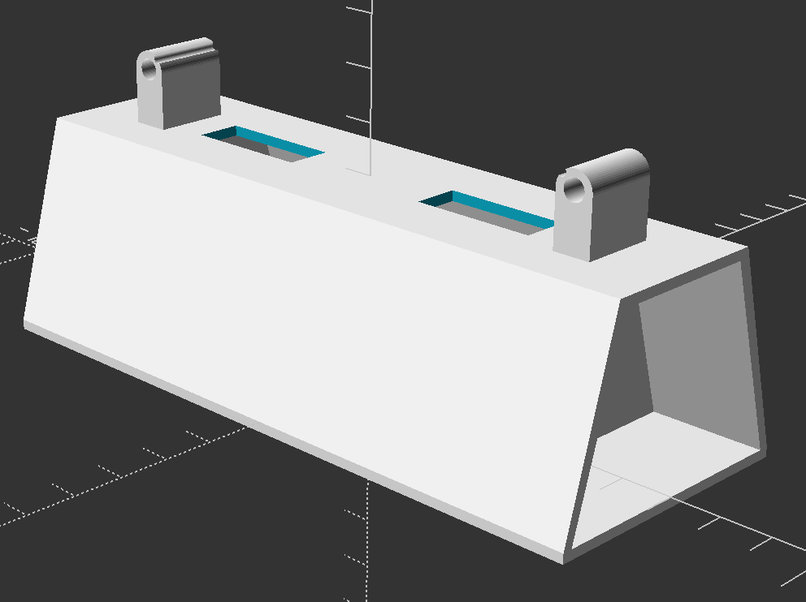
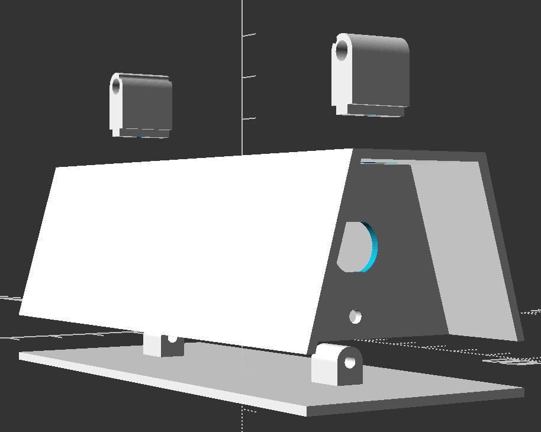
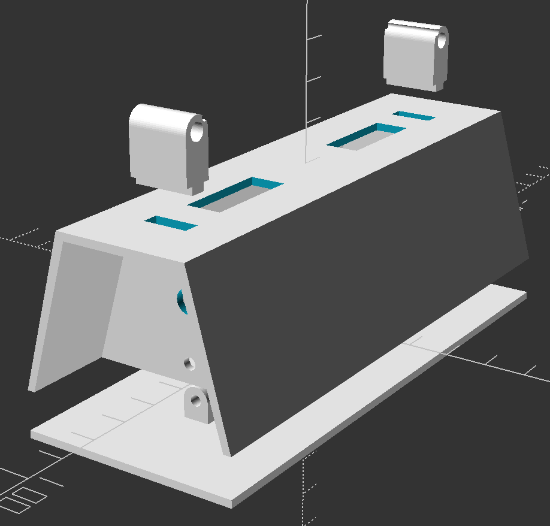

# Solder Fume Extractor

## Components

### 1. Base

Trapezoid-like structure that hosts the wiring.
Includes two "walls" on the side:

1. DC 12V Power socket hole
2. Power switch hole

Has two sets of holes at the top:

1. Two holes for the fan wires
2. Two holes for the fan connectors

### 2. Fan connectors

Tubes that connect the base to the fan:

1. 2xM4 50mm bolts connect the fan connector and the fan
2. 2xM3 5mm bolts connect the fan connector and the base

### 3. Base bottom lid

Covers the inner wirings of the base. A flat plate with two connectors that
attach to the base from the side with 2xM3 5mm bolts.
